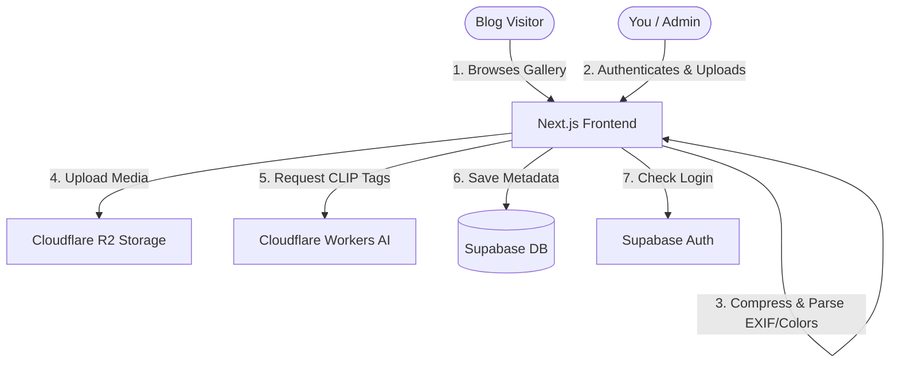

# Project Architecture & Database Schemas

This document details the database models, cloud relationships, and media pipeline configurations for the photography blog.

---

## Architecture Overview



---

## Database Models (Supabase PostgreSQL)

You must run the following SQL script in your Supabase SQL Editor to initialize the tables, indexes, and Row Level Security (RLS) policies:

```sql
-- Enable UUID extension
create extension if not exists "uuid-ossp";

-- 1. ALBUMS TABLE
create table public.albums (
  id uuid default gen_random_uuid() primary key,
  title text not null,
  slug text not null unique,
  description text,
  location text,
  date date not null default current_date,
  cover_image_url text,
  is_published boolean default false not null,
  created_at timestamp with time zone default timezone('utc'::text, now()) not null
);

-- 2. PHOTOS TABLE
create table public.photos (
  id uuid default gen_random_uuid() primary key,
  album_id uuid references public.albums(id) on delete cascade not null,
  url text not null,                -- Cloudflare R2 public URL for the optimized WebP image
  thumbnail_url text,              -- Cloudflare R2 public URL for the timeline WebP thumbnail
  location text,                    -- Specific photo spot name or GPS coordinates
  width integer not null,
  height integer not null,
  aspect_ratio numeric(4,2) not null, -- width / height (used to build dynamic masonry layouts)
  sort_order integer default 0 not null,
  
  -- Metadata
  tags text[] default '{}'::text[] not null, -- AI and EXIF tags (e.g. ['glacier', 'night'])
  color_palette text[] default '{}'::text[] not null, -- 5 dominant hex codes extracted from photo

  -- EXIF metadata
  exif jsonb default '{}'::jsonb not null,
  
  created_at timestamp with time zone default timezone('utc'::text, now()) not null
);

-- Indexes for performance
create index photos_album_id_idx on public.photos(album_id);
create index photos_sort_order_idx on public.photos(sort_order);
create index albums_slug_idx on public.albums(slug);

-- Enable Row Level Security (RLS)
alter table public.albums enable row level security;
alter table public.photos enable row level security;

-- Policies for public reading
create policy "Public Select Albums"
  on public.albums for select
  using (is_published = true);

create policy "Public Select Photos"
  on public.photos for select
  using (
    exists (
      select 1 from public.albums
      where albums.id = photos.album_id and albums.is_published = true
    )
  );

-- Policies for Admin uploads (Authenticated users)
create policy "Admin Albums"
  on public.albums for all
  to authenticated
  using (true);

create policy "Admin Photos"
  on public.photos for all
  to authenticated
  using (true);
```

---

## Media Upload Pipeline (`/api/upload`)

When you upload an image through the Admin dashboard, the following processing occurs on the Next.js API server:

1. **Authentication Check**: Verifies the admin's Supabase JWT session token.
2. **Metadata Extraction**: Reads the raw image buffer using `exifr` to extract camera model, lens model, aperture, shutter speed, ISO, focal length, and GPS coordinates.
3. **Color Palette Analysis**: Uses `sharp` to resize the image to a `5x5` pixel matrix. The server samples 5 distinct pixels from the matrix and converts them to Hex codes to assemble the dominant color palette.
4. **Image Compression**: Sharp resizes and compresses the photo:
   - **Main Web Image**: Compressed WebP format, max width/height `2048px`, quality `80%`.
   - **Timeline Thumbnail**: Compressed WebP format, max width/height `300px`, quality `75%`.
5. **R2 Upload**: Stores both optimized files securely in your Cloudflare R2 bucket.
6. **AI Tagging**: Next.js sends a base64 encoded thumbnail to Cloudflare Workers AI's CLIP model (`@cf/openai/clip-vit-base-patch32`) along with a pre-defined set of photography keywords. The model returns probability scores, and tags with a score > 0.15 are selected.
7. **Rule-Based Tagging**: Merges CLIP tags with date-based metadata (e.g. adding `night` if shot between 8 PM and 6 AM, or `Sony` if shot on a Sony camera).
8. **DB Write**: Inserts the URLs, colors, EXIF object, and tags into the Supabase database.
